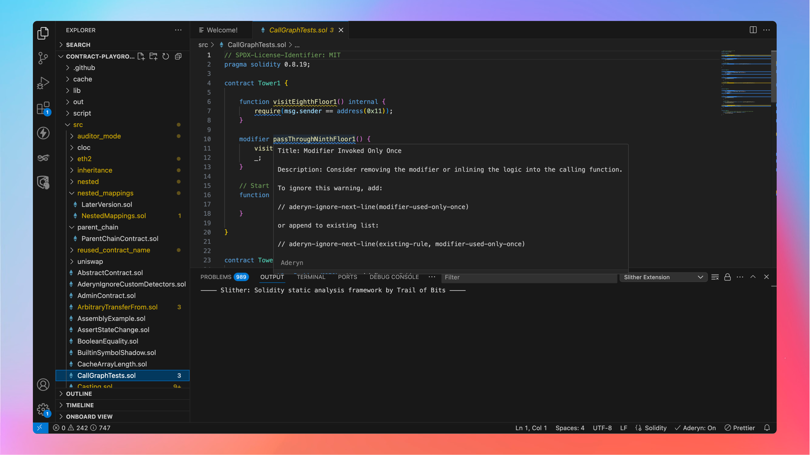

# Aderyn - Solidity Security Extension for VS Code ✨  

Aderyn is a Rust-based Solidity static analyzer that detects vulnerabilities in smart contracts during development. With the Aderyn VS Code Extension, Smart contract security checks become an effortless part of your development workflow. 

Here’s what you can expect:
- **Fast, real-time security checks:** Spot issues the moment you save your Solidity files, without running commands manually. 
- **Structured tree view:** See all vulnerabilities at a glance and navigate them effortlessly.  
- **AI-powered fixes:** Squiggly lines highlight issues, and AI tools may assist in quick resolution.  
- **Automatic updates and easy setup:** The extension manages Aderyn installations for you.


For a list of supported vulnerabilities, visit the [official Cyfrin Research docs](https://cyfrin.gitbook.io/cyfrin-docs/aderyn-vs-code/supported-detector).

</br>

## 🚀 Installation

> **Microsoft Windows Users: For the Aderyn Extension to work, you must run VS Code using [WSL](https://learn.microsoft.com/en-us/windows/wsl/)**.

1. Install Aderyn via the [VS Code Marketplace](https://marketplace.visualstudio.com/items?itemName=Cyfrin.aderyn)
2. Visit the Welcome page (Aderyn will open this in your IDE)
3. Aderyn is ready to look for vulnerabilities in your codebase.
   
Aderyn works seamlessly on commonly recognized project structures i.e when a foundry.toml or hardhat.config.ts is found in the root of the workspace. 
If not in the root file, make sure your aderyn.toml file correctly points to your foundry.toml or hardhat.config.toml file

Learn how to run Aderyn on a custom project structure [in this guide](https://cyfrin.gitbook.io/cyfrin-docs/aderyn-vs-code/run-aderyn-on-a-custom-project).

</br>

## 🔹 Features  

### 1. Inline diagnostics and real-time feedback
Aderyn runs in the background, analyzing your Solidity code as you work, giving you access to:

* **Real-time vulnerabilities report:** Errors and vulnerabilities appear right in your code, just like syntax errors.  
* **Inline explanations:** Get detailed insights into each issue without leaving your editor.
* **AI-assisted fixes:** Copilot and other AI tools can interface with Aderyn to help resolve flagged issues, making security fixes quicker.  


### 2. All your code vulnerabilities listed
To help you stay organized, Aderyn provides a tree view in the VS Code Activity Bar. This gives you a comprehensive overview of all detected issues across your project. Instead of manually searching for vulnerabilities file by file, you get a centralized list to navigate and resolve problems efficiently.  

### 3. Continuous monitoring and background analysis 
Aderyn instantly scans for vulnerabilities and updates diagnostics whenever you save a file. You don't need to rerun commands manually. The extension works silently in the background, ensuring your security checks stay updated as you develop.  

### 4. Automatic setup and seamless integration
The extension automatically installs and starts scanning your Solidity files, ensuring you're always using the latest Aderyn version and vulnerability detectors. Just install it and start coding. Aderyn takes care of the rest.  

</br>

## 📚 Docs

- For docs, navigate to the command menu <kbd>Ctrl/Cmd</kbd> <kbd>Shift</kbd> <kbd>P</kbd> and search for `Aderyn: Welcome on board`

For in-depth docs, navigate to the [official Cyfrin Research docs](https://cyfrin.gitbook.io/cyfrin-docs/aderyn-vs-code/).

</br>

## 🛠 Contributing  

Before you start contributing, visit the [issue tracker](https://github.com/Cyfrin/vscode-aderyn/issues) to find a list of open issues or to create a new one.

To start contributing:

1. Clone the repository:  
   ```sh
   git clone https://github.com/cyfrin/vscode-aderyn.git
   ```
2. Navigate to the extension folder:  
   ```sh
   cd vscode-aderyn
   ```
3. Install dependencies:  
   ```sh
   make
   ```  
3. Start the development server:  
   ```sh
   make dev
   ```   
4. Open the project in VS Code and press **F5** to launch a development instance.  

If you need to debug the language server, follow these additional steps and run `make dev` again:

1. Install [Rust](https://www.rust-lang.org/) and clone [Aderyn](https://github.com/cyfrin/aderyn) separately.  

2. Create a [`manifest`](https://github.com/Cyfrin/vscode-aderyn/blob/main/manifest.sample) file and point it to **Cargo.toml** in Aderyn’s repository. 

</br>

## ⁉️ FAQs and troubleshooting

1. **Can I run Aderyn on multiple projects in the same directory?**

   If there are multiple parallel solidity projects in the same workspace it will not be supported. Two instances of the editor vscode must be opened and treated as separate projects.

2. **Can I use Aderyn on a custom project structure (not Foundry or Hardhat)?**

   If the project's framework config file is nested in some directory or is using a custom build pipeline, please create an aderyn.toml by typing <kbd>Ctrl/Cmd</kbd> + <kbd>Shift</kbd> + <kbd>P</kbd>  and search for "Aderyn: initialize config file". 

   Learn how to properly edit the aderyn.toml file on the [official Cyfrin Research docs](https://cyfrin.gitbook.io/cyfrin-docs/aderyn-vs-code/supported-detector).

3. **How do I open the Welcome Page?**

   To open the welcome page, press: <kbd>Ctrl/Cmd</kbd> + <kbd>Shift</kbd> + <kbd>P</kbd>  and search for "Aderyn: Welcome" 

4. **Can I use in Windows?**

   To use in Windows, you must have WSL installed. Then open VS Code from the terminal using `code .`
   
5. **Can I customize the scope of the files to be scanned?**

   To customize the scope of the files to be scanned, initialize a config file using the commnad `Aderyn: Initialize Config` 

6. **Why isn’t Aderyn displaying any found vulnerabilities?**
   
   If Aderyn isn’t showing any vulnerabilities, follow these steps to ensure it is functioning correctly:
   * **Access the Welcome Page:**

     * Press <kbd>Ctrl/Cmd</kbd> + <kbd>Shift</kbd> + <kbd>P</kbd> > to open the command palette.
     * Type ⁠`Aderyn: Welcome` and select it.
   
	* **Check for Errors:**

      	* Look for any error messages displayed in red on the Welcome page.
      	* Look for errors in the Cyfrin Aderyn Diagnostics panel that opens in the sidebar. (Compilation errors / Bad remappings)
      	* If an error is present, carefully follow the instructions provided to resolve the issue.
   
	* **Verify Project Compatibility:**

      	* Ensure that you have a compatible project open. Aderyn requires one of the following configuration files in the root folder of your workspace:
            
           * foundry.toml
      	   * hardhat.config.ts
      	   * ⁠aderyn.toml

   * **Address Displayed Errors:**
   
   	   * If any errors are shown, take appropriate action based on the messages to rectify the issue.
      	
   If you’ve followed these steps and Aderyn still isn’t showing any vulnerabilities, open a [new issue](https://github.com/Cyfrin/vscode-aderyn/issues) or contact support on [Discord](https://discord.gg/cyfrin).

6. **Customize auto start behavior**

    To customize the auto start behavior (turn it on and off), visit `Aderyn: Open Settings`

7. **Failed to Cross Check error in Welcome Page**

    * To fix this error, uninstalling all versions of the extension and freshly installing the latest version helps.
    * If you have multiple versions of VS Code itself in your system, try the other one (or) better - just delete duplicate installations. Keep only 1.

</br>

## ✋ Feedback and Support

Cyfrin [Discord Server](https://discord.gg/cyfrin).

Follow [Cyfrin Research on Twitter](https://x.com/cyfrinresearch).


